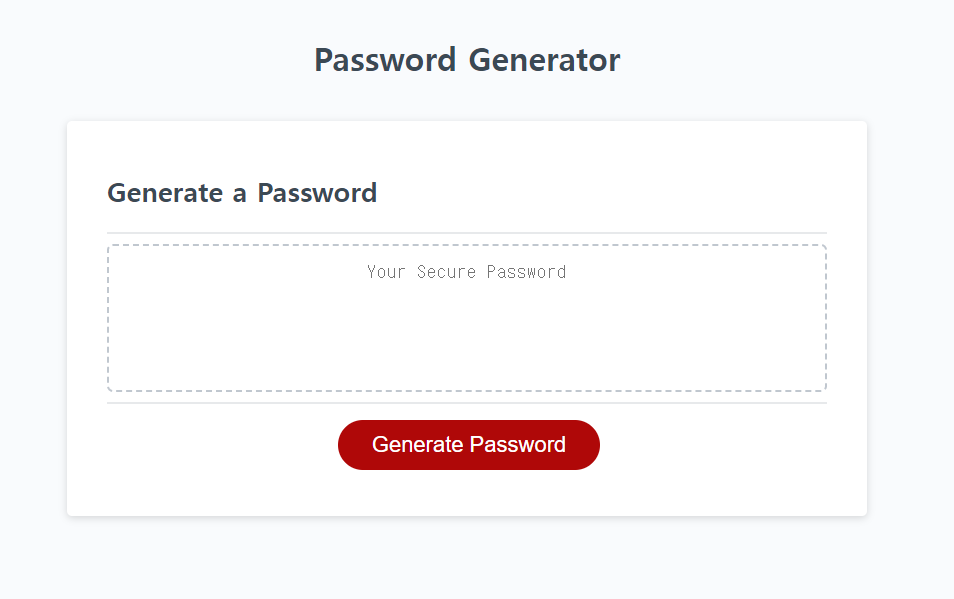

# pwd-challenge-3

## Description
This project was created to make a password generator application that allows
employees to generate random passwords according to their chosen criteria.

If the user requests to generate a password that does not meet the criteria, an alert will be displayed to allow them to make a new selection according to the criteria.

## Live link
[**https://yiseo.github.io/pwd-challenge-3/**](https://yiseo.github.io/pwd-challenge-3/)

## Screenshot

## Installation
N/A

## Technologies Used
- HTML
- CSS
- Javascript
- Github